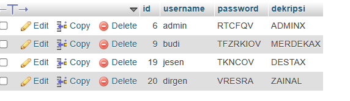
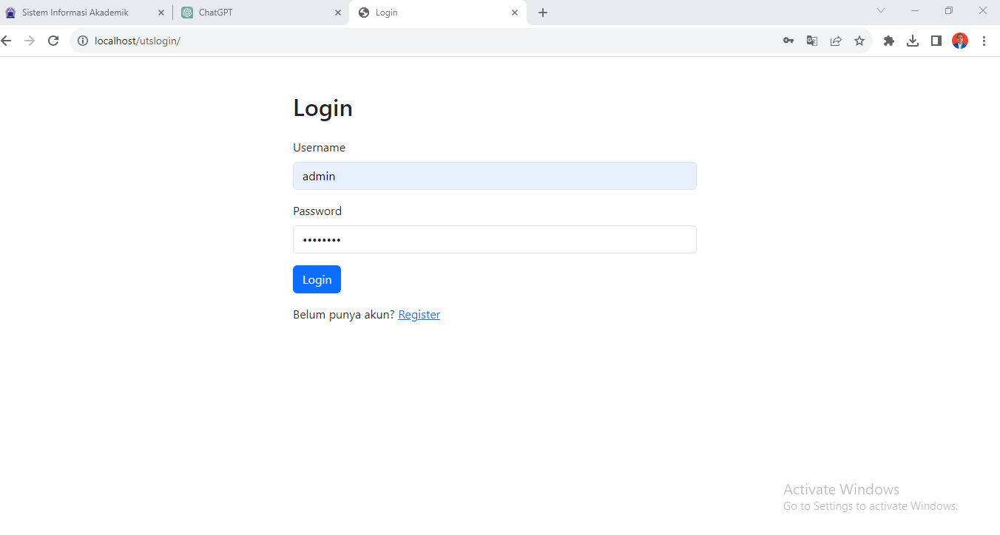
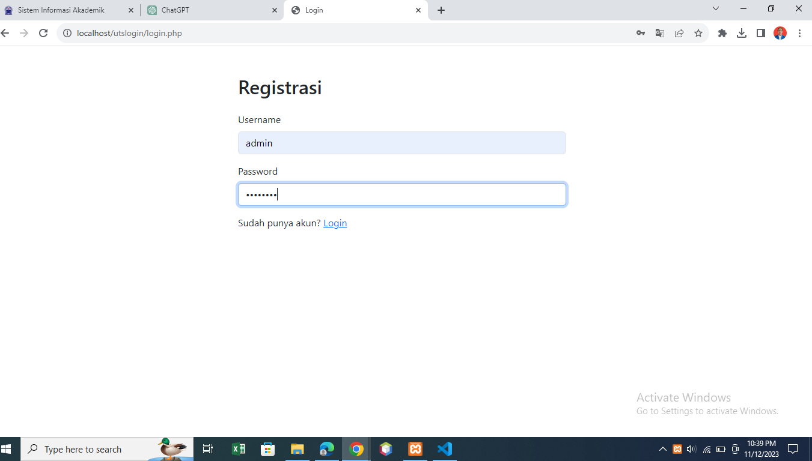

# UTS-KRIPTOGRAFI

## Profil
| #               | Biodata                      |
| --------------- | ---------------------------- |
| **Nama**        | Modesta Liunesi              |
| **NIM**         | 312110142                    |
| **Kelas**       | TI.21.A.1                    |
| **Mata Kuliah** | Kriptografi                  |

## Tugas Uts

# Implementasi Hill Cipher pada Sistem Login Aplikasi Web

# Deskripsi Masalah:

Hill Cipher adalah sebuah cipher blok yang mengenkripsi data menggunakan teknik aljabar linear. Dalam soal ini, Anda akan menggunakan Hill Cipher untuk mengamankan password pada sistem login aplikasi web. Cipher ini
menggunakan sebuah matriks kunci untuk melakukan enkripsi dan matriks yang invers untuk dekripsi. Untuk
menyederhanakan, asumsikan matriks kunci adalah matriks 2x2 dan semua operasi dilakukan dalam modulo 26. Spesifikasi Tugas:

1. Tulis fungsi hillEncrypt(password, keyMatrix) yang menerima dua argumen: password, sebuah string yang
terdiri dari huruf kecil (a-z) yang merepresentasikan password pengguna; dan keyMatrix, matriks 2x2 yang
digunakan sebagai kunci untuk enkripsi. Fungsi ini harus mengembalikan string yang merupakan hasil
enkripsi dari password. 2. Tulis fungsi hillDecrypt(encryptedPassword, inverseKeyMatrix) yang akan digunakan oleh server untuk
mendekripsi password yang telah dienkripsi. Fungsi ini menerima dua argumen: encryptedPassword, string
hasil enkripsi; dan inverseKeyMatrix, matriks invers dari keyMatrix. Fungsi ini harus mengembalikan
password asli. 3. Pastikan bahwa password memiliki panjang genap. Jika tidak, tambahkan 'x' di akhir password sehingga
panjangnya menjadi genap.

# Pembuatan

1. Pertama, buat table users di database yang terdiri id, username, password, dan dekripsi. Memang untuk pembuatan table users tidak perlu ada kolom dekripsi tetapi untuk memenuhi
ketentuan dari tugas nomor 2 saya membuat kolom dekripsi yang mendeskripsikan text password
yang sudah di enkripsi dan di taruh di kolom password.

# 2. Untuk membuat fungsi hillEncrypt yang mengenkripsi password
menggunakan matriks kunci 2x2 (keyMatrix), Pastikan panjang password adalah kelipatan 2 (jika
tidak, tambahkan karakter atau lakukan padding).Konversi setiap huruf dalam password menjadi
angka sesuai dengan posisi mereka dalam alfabet (misalnya, 'a' menjadi 0, 'b' menjadi 1, dst).Pisahkan password menjadi pasangan dua huruf.Hitung hasil perkalian matriks keyMatrix
dengan vektor representasi huruf-huruf tersebut. Modulo hasil perkalian dengan 26 (jumlah huruf
dalam alfabet Inggris) untuk mendapatkan angka yang sesuai:

def hillEncrypt(password, keyMatrix):
# Fungsi untuk mengonversi huruf menjadi angka
def letter_to_number(letter):
return ord(letter) - ord('a')

# Fungsi untuk mengonversi angka kembali menjadi huruf
def number_to_letter(number):
return chr((number % 26) + ord('a'))
# Pastikan panjang password adalah kelipatan 2 (lakukan padding jika perlu)

if len(password) % 2 != 0:

password += 'x' encrypted _password = "" 3. Pastikan bahwa password memiliki panjang genap. Jika tidak, tambahkan 'x' di akhir password
sehingga panjangnya menjadi genap. untuk memastikan bahwa panjang password adalah bilangan genap. Sistem Hill Cipher yang
dijelaskan mengharapkan panjang password yang akan dienkripsi adalah kelipatan 2, karena setiap
dua huruf akan diambil sebagai satu pasangan untuk dienkripsi. 
if len(password) % 2 != 0:

# Untuk Key yang saya gunakan adalah : [ [2, 1], [3, 4]]

# Tampilan form login

# Tampilan form Register

## TERIMAKSIH